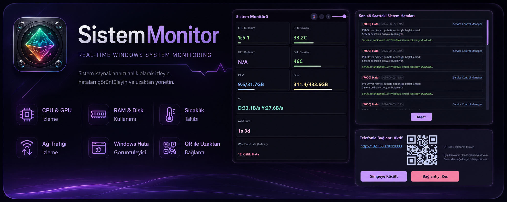
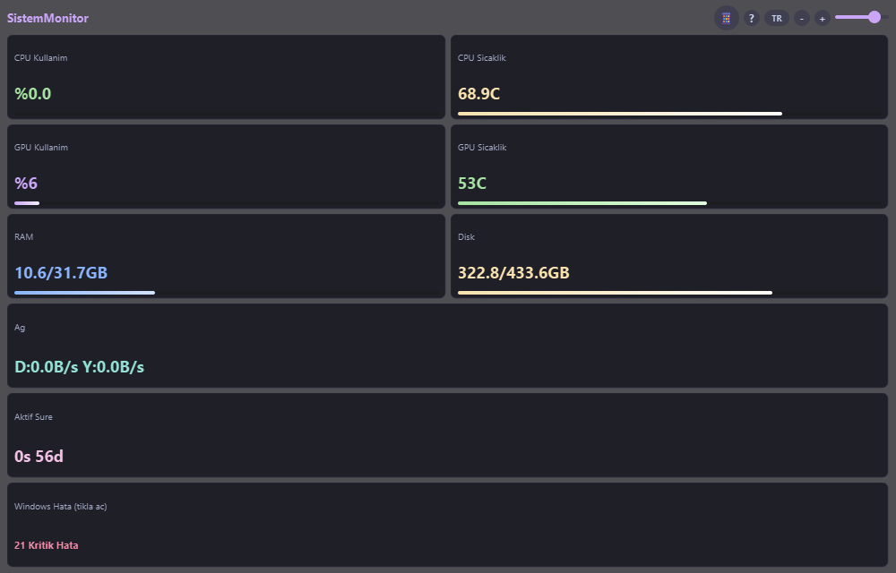
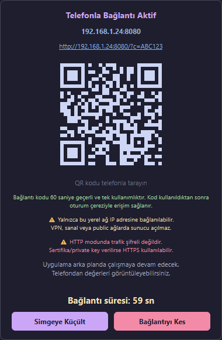
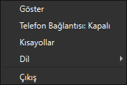

<p align="center">
  
</p>

<h1 align="center">SistemMonitor</h1>

<p align="center">
  <b>Real-time system monitoring app for Windows</b><br>
  CPU, GPU, RAM, Disk, Network and Windows error logs on a single screen.
</p>

<p align="center">
  English · <a href="README.md">Türkçe</a>
</p>

<p align="center">
  
  
  
  
  
  
</p>

---

## 📑 Table of Contents

- [✨ Features](#features)
- [📸 Screenshots](#screenshots)
- [📱 Connect from Your Phone](#connect-from-your-phone)
- [🔒 Security](#security)
- [🖥️ Installation](#installation)
- [🎮 Shortcuts](#shortcuts)
- [🌐 Changing Language](#changing-language)
- [🧰 Tech Stack](#tech-stack)
- [🗺️ Roadmap](#roadmap)
- [❓ FAQ](#faq)
- [🧪 Tests](#tests)
- [🔍 Continuous Security (GitHub Actions)](#continuous-security-github-actions)
- [🤝 Contributing & Support](#contributing-support)
- [🖥️ Requirements](#requirements)

---

## ✨ Features

- **⚡ Real-time CPU usage** and temperature monitoring (~5s refresh)
- **🎮 Real-time GPU usage** and temperature monitoring (NVIDIA)
- **🧠 RAM** usage monitoring
- **💾 Disk** usage monitoring
- **🌐 Network** speed monitoring (download / upload)
- **📋 Windows error log** viewer (last 48 hours)
- **📱 Remote monitoring from your phone** — via QR code (same Wi-Fi / LAN)
- **🖥️ System tray** support — keeps running in the background
- **🌐 Turkish / English** language support (instant switching)

## 📸 Screenshots

| Main Window | Phone Connection (QR) |
|-------------|-----------------------|
|  |  |

> System tray context menu:
>
> 

## 📱 Connect from Your Phone

The fan-favorite feature: **scan the QR code with your phone and watch your PC's live status from your phone.**

1. Press `F2` or click the 📱 button
2. Scan the QR code with your phone (or enter the URL shown on screen)
3. Watch the values live from your phone
4. The app keeps running in the background

> The pairing code is valid for **60 seconds** and is **single-use**. It is destroyed on the
> first successful connection; further access uses the session cookie.

Phone connection works only on the **local network (LAN/Wi-Fi)**; no server is opened on VPN,
virtual or public networks.

## 🔒 Security

The phone connection is **off by default**; when enabled, security is part of the core design:

- The server binds only to a **safe local network adapter** (private `10.x`, `172.16-31.x`, `192.168.x`). VPN, virtual and public networks are **rejected**.
- **Single-use pairing code**: valid for 60 seconds, destroyed on first connection.
- After pairing, an `HttpOnly; SameSite=Strict` **session cookie** is issued; no persistent token travels in the URL. Token comparison uses `secrets.compare_digest()`.
- Authentication is **fail-closed**: requests without token/session get 403; Host and Origin validation is identical for GET and POST.
- **Per-endpoint rate limit**, **4 KB request body limit**, security headers (`nosniff`, `no-referrer`, `no-store`) and **masking** of the pairing code in logs.
- Expired sessions and rate-limit records are periodically cleaned up.

### Transport security (TLS)

The phone connection is LAN-only; in the default HTTP mode traffic is unencrypted. For optional
**HTTPS**, provide a certificate + private key and the server starts with TLS and adds the `Secure`
flag to the session cookie:

```powershell
openssl req -x509 -newkey rsa:2048 -keyout key.pem -out cert.pem -days 365 -nodes
```

```python
start_phone_server(monitor, tls_cert="cert.pem", tls_key="key.pem")
```

If only one of cert/key is provided or the file is missing, the server does not silently fall back
to HTTPS; a clear error is shown to the user.

## 🖥️ Installation

1. Download `SistemMonitor.exe` from the [Releases](/Bedrettin1/SistemMonitor/releases) page
2. Run it — no Python or other dependency required

### Run from source

```powershell
pip install -r kaynak/requirements.txt
python kaynak/sistem_monitor.py
```

## 🎮 Shortcuts

| Key | Action |
|-----|--------|
| `F1` | Show shortcuts page |
| `F2` | Toggle phone connection |
| `F4` | Minimize to tray / restore |
| `Esc` | Exit overlay mode |
| `Ctrl+B` | Enlarge window |
| `Ctrl+S` | Shrink window |
| `F5` | Refresh data |

## 🌐 Changing Language

- Click the **TR/EN** button in the title bar, or
- System tray menu → **Dil / Language**.

The interface and phone page update instantly; the preference is saved.

## 🧰 Tech Stack

| Technology | Usage |
|------------|-------|
| **PySide6** (Qt6) | Desktop GUI |
| **PyInstaller** | Single-file EXE build |
| **psutil** | CPU / RAM / disk / network metrics |
| **pynvml** | NVIDIA GPU temperature & usage |
| **pythonnet + LibreHardwareMonitorLib** | Hardware sensors (with optional driver) |
| **qrcode** | Phone pairing QR code |
| **Pillow** | Image processing |

## 🗺️ Roadmap

- 🔧 Broader GPU vendor support (AMD, Intel)
- 🌡️ Harden CPU temperature source (prefer LHM CPU Package when driver present)
- 🎨 Light / dark theme options
- 🧩 Customizable card layout
- 📦 Portable configuration file

## ❓ FAQ

**❔ Why is the EXE so large (~60 MB)?**
> The PyInstaller single-file build bundles the whole Python runtime (PySide6, LHM libraries) inside the exe; hence the size, but it requires no installation.

**❔ Why does the phone connection only work on the local network (LAN/Wi-Fi)?**
> For security, no server is opened on public, VPN or virtual networks; the server binds only to private adapters.

**❔ Why does it read CPU temperature via WMI?**
> If the LibreHardwareMonitor kernel driver is unavailable on a machine, WMI `ThermalZoneInformation` is the primary source (Kelvin → Celsius). When the driver is present, LHM CPU Package is used.

**❔ Do I need Python installed?**
> No. The Release EXE runs standalone; Python is only needed to run from source.

**❔ Does it trigger antivirus warnings?**
> Single-file builds can trigger false positives on some AVs. The source is open; you can build it yourself if you prefer.

## 🧪 Tests

```powershell
python kaynak/test_security.py
```

Security tests: token validation (wrong/expired/replayed), rate limit, brute-force pairing,
request body limit, 100 concurrent connections, SSE disconnect/cleanup, no bind on VPN/public
adapters, CORS/Host/IPv6 validation, session auth, Event Log JSON normalization, network speed
calculation, TLS cookie/validation, log redaction and i18n/translation.

## 🔍 Continuous Security (GitHub Actions)

- `security.yml`: Bandit, Ruff, pip-audit (CVE) and Semgrep scans + **security/regression tests**
  run on every push/PR (a test failure stops the pipeline).
- `release.yml`: builds automatically on `v*` tags; uploads EXE, source, SHA-256 and SBOM to the release.

## 🤝 Contributing & Support

- ⭐ If you like it, **star the repo** — it motivates!
- 🐞 Open an **[Issue](/Bedrettin1/SistemMonitor/issues)** for bugs or suggestions.
- 🔀 To contribute: fork → feature branch (`git checkout -b feature`) → PR. Security tests run
  automatically in CI; merges are blocked until tests pass.

## 🖥️ Requirements

- Windows 10 / 11 (64-bit)
- NVIDIA driver for GPU temperature monitoring (optional)
